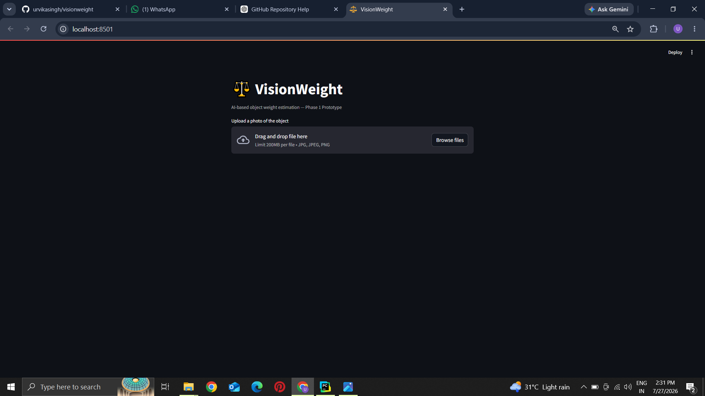
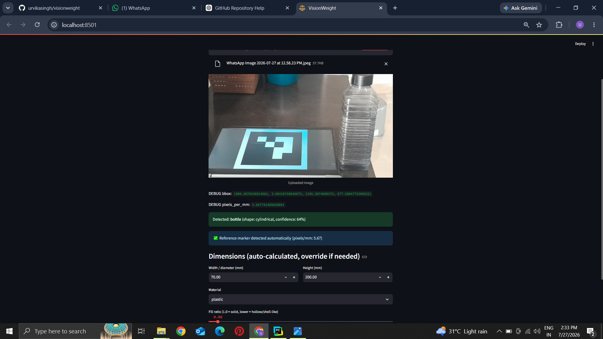
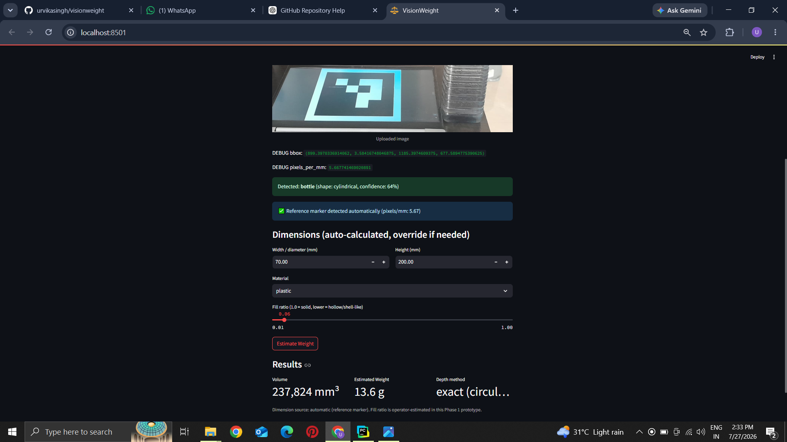

# ⚖️ VisionWeight

VisionWeight is a computer vision application that estimates the approximate weight of an object from a single RGB image. The application combines object detection, ArUco marker-based calibration, geometric volume estimation, and material density to calculate an estimated weight through an interactive Streamlit interface.

---

## Overview

The application follows a geometry-based approach for weight estimation.

1. Detects the object using YOLOv8.
2. Uses an ArUco marker placed in the image for real-world calibration.
3. Converts object dimensions from pixels to millimeters.
4. Estimates the object's volume based on its geometric shape.
5. Calculates the approximate weight using predefined material densities.

The application provides an interactive interface where users can upload an image, choose the object's material, and view the estimated weight.

---

## Screenshots

### Home Screen



### Object Detection and Dimension Estimation



### Estimated Weight



---

## Features

- Object detection using YOLOv8
- ArUco marker-based calibration
- Pixel-to-millimeter conversion
- Geometric volume estimation
- Material-based weight estimation
- Interactive Streamlit interface

---

## Tech Stack

- Python
- Streamlit
- OpenCV
- Ultralytics YOLOv8
- NumPy
- cvzone

---

## Project Structure

```text
visionweight/
│
├── app.py
├── pipeline/
│   ├── calibrate.py
│   ├── detect.py
│   ├── volume.py
│   └── weight.py
│
├── screenshots/
│   ├── home.png
│   ├── upload.png
│   └── result.png
│
├── requirements.txt
├── README.md
└── ...
```

---

## Workflow

```text
Input Image
      │
      ▼
YOLOv8 Object Detection
      │
      ▼
ArUco Marker Detection
      │
      ▼
Pixel-to-Real-World Calibration
      │
      ▼
Dimension Estimation
      │
      ▼
Volume Estimation
      │
      ▼
Material Density
      │
      ▼
Estimated Weight
```

---

## Installation

### Clone the repository

```bash
git clone https://github.com/urvikasingh/visionweight.git
```

### Navigate to the project directory

```bash
cd visionweight
```

### Install the required dependencies

```bash
pip install -r requirements.txt
```

### Run the application

```bash
streamlit run app.py
```

---

## Usage

1. Launch the Streamlit application.
2. Upload an image containing an object and an ArUco marker.
3. Select the object's material.
4. Review the detected dimensions.
5. Click **Estimate Weight** to view the estimated weight.

---

## Limitations

- An ArUco marker must be visible in the image for calibration.
- Weight estimation depends on the selected material density.
- Volume estimation is based on predefined geometric shapes.
- The calculated weight is an approximation and may differ from the actual weight.

---

## Future Improvements

- Support additional object shapes.
- Improve estimation for irregular objects.
- Add confidence metrics for weight estimation.
- Support estimation of multiple detected objects in a single image.

---

## License

This project is intended for educational and learning purposes.